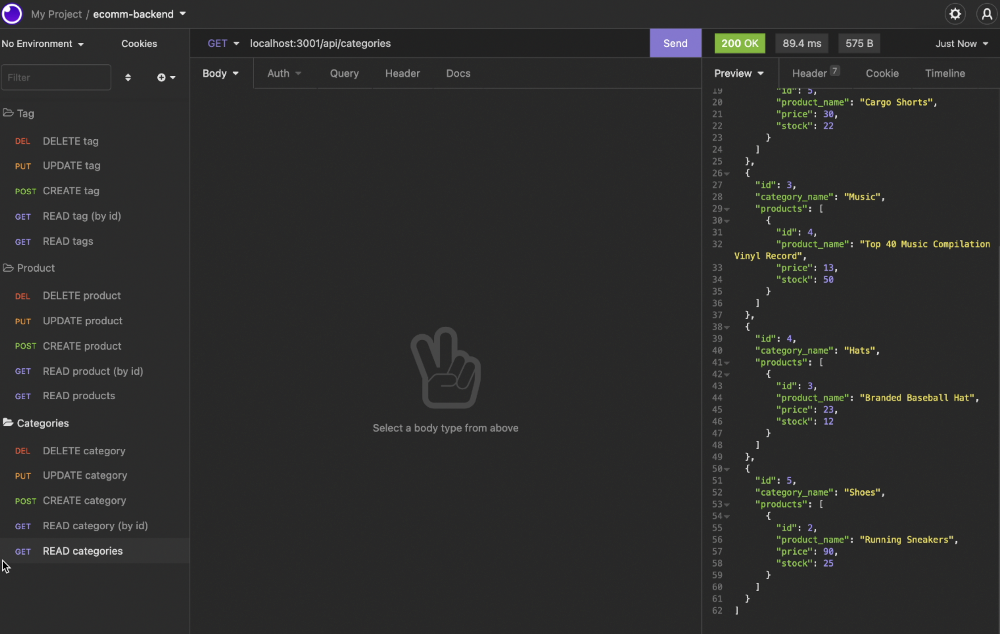
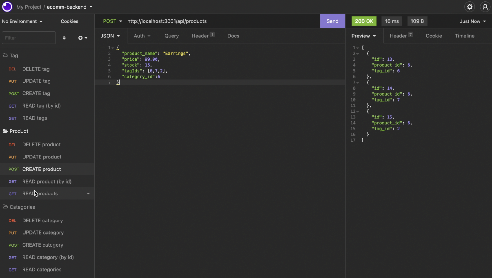
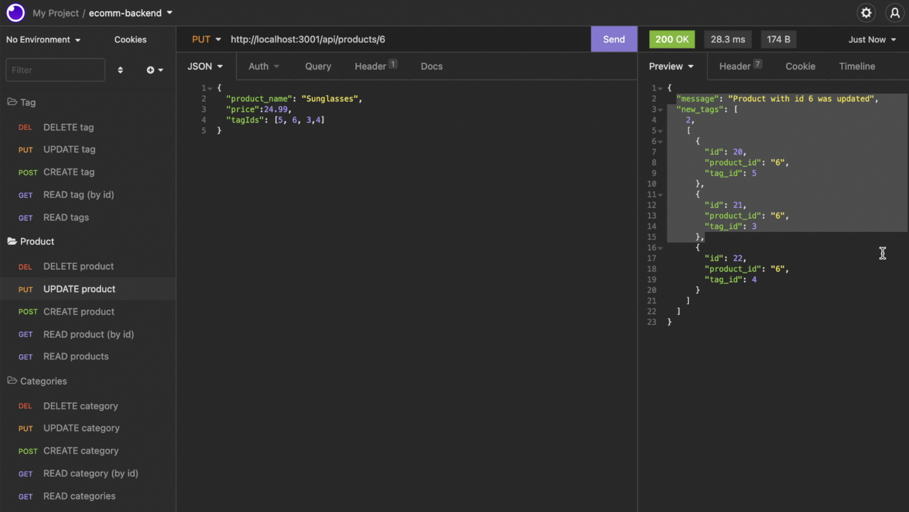
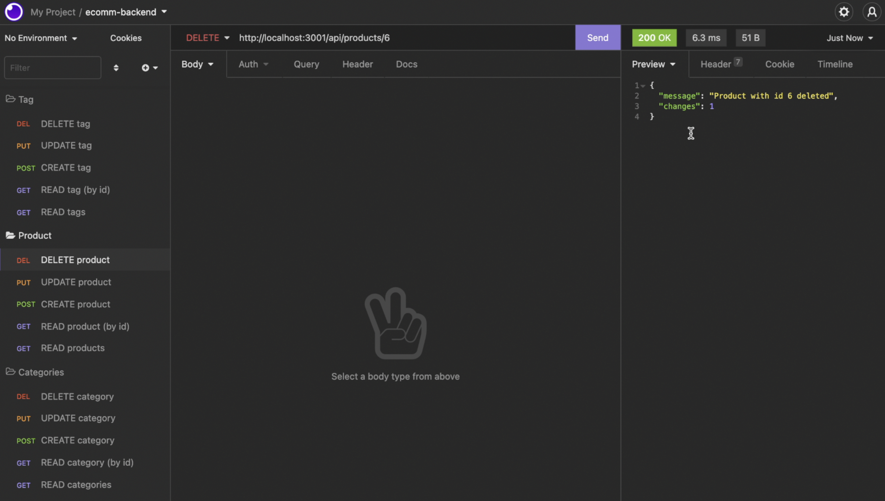

# E-commerce Back End
 

Back end access for ecommerce retail business with SQL database.

### Table of Contents
* [Description](#description)
* [Installation](#installation)
  * [Prerequisites](#prerequisites)
  * [Getting Started](#getting-started)
* [Usage](#usage)
* [Contributions](#contributions)
* [License](#license)
* [Questions & Contact](#questions-and-contact)
* [Acknowledgements &#x2763;](#acknowledgements)

## Description
E-commerce Back End is the back end for an e-commerce site. It uses an Express.js API and Sequelize to interact with a MySQL database. It offers create, read, update, and delete functionality.

## Installation
### Prequisites
This application requires that you have Node.js, MySQL server, and the MySQL shell.

### Getting Started
Navigate to the root folder of the application from you CLI. Install the dependencies with the command ```npm i```. Once the project is intalled, connect to your database:
```
mysql -u <your_user> -p
```

Leave out ```-p``` if you're not using a password. Next, create the database. From the mysql shell, run the folowing command:
```
source db/schema.sql
```

Close the mysql shell. Ecommerce Backend is now installed and your database is ready to use. If you'd like to use the example records included with this project, run the command  ```npm run seed```.

## Usage
Watch this [walkthrough video]() for a detailed view of each route and request body.

To launch the app, navigate to the root folder of the project from your CLI. Run the command ```npm start``` or ```node server.js```.

Next, launch your API testing platform (like Insomnia) and enter the HTTP address where your server is running, most likely http://localhost:3001, with the route you'd like to use (for example /api/categories). Get and delete routes do not require a request body. Put and post routes (update and create, respectively), require a JSON request body.

Here are some examples of the API in action:
<strong>GET routes</strong>


<strong>POST routes</strong>


<strong>PUT routes</strong>


<strong>DELETE routes</strong>


## Contributions
This project uses the following packages:
* [Express](https://www.npmjs.com/package/express)
* [MySQL 2](https://www.npmjs.com/package/mysql2)
* [Sequelize](https://www.npmjs.com/package/sequelize)

Code for the server was provided in the curricullum for Columbia University's Full-Stack Bootcamp.

## License 
This is an open source project and falls under an [ISC license](./LICENSE.md).

## Questions and Contact
Back end written by Lelah Bates Childs.

You can find me on GitHub [@labchild](https://github.com/labchild) or [email me](mailto:labchilds@gmail.com). If you have any questions about this project, please reach out.

If you encounter any bugs or other problems, [submit an issue](https://github.com/labchild/ecomm-backend/issues).

### Want to Help?
Do you see something I missed or a more succint and effective way this code can be written? Great! Please reach out and let me know how I can improve. Thanks in advance for your tips, tricks, and pointers!

## Acknowledgements
Thank you to my bootcamp instructional team and cohort, for helping me along this journey to become a developer.
